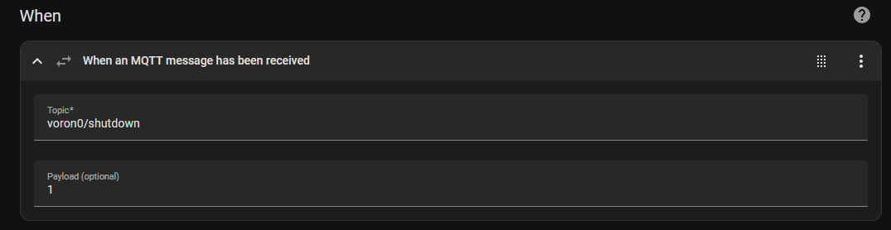
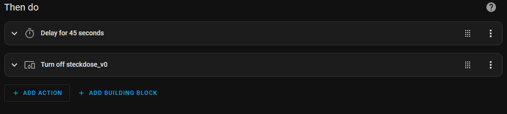

* Add MQTT Server to `moonraker.conf`

```
[mqtt]
address:<IP-Adress of MQTT Server>
username: {secrets.mqtt_credentials.username}   #username and password saved externally in moonraker.secrets file
password: {secrets.mqtt_credentials.password}   
enable_moonraker_api: True
```


`sudo nano ~/printer_data/moonraker.secrets`

```
# /home/pi/printer_data/moonraker.secrets

[mqtt_credentials]
username: your_mqtt_username
password: your_mqtt_password
````


* Add macro to publish a mqtt topic Home Assistant listens to:

```
[gcode_macro _MQTT_SHUTDOWN]
gcode:
  
  {action_call_remote_method("publish_mqtt_topic",
                             topic="shutdown",
                             payload=1,
                             qos=0,
                             retain=False,
                             use_prefix=True)}
```

* Macro to initialize shutdown
```
[gcode_macro SHUTDOWN]
gcode:
  _MQTT_SHUTDOWN                                 #Send MQTT Message to HA
  {action_call_remote_method("shutdown_machine")} #Shutdown Pi
```


* Add Automation to Home Assistant:
	- Use the Gui to add the Automation. When the MQTT Payload is received add a delay so the pi can safely shutdown
 	- Replace voron0 from the screen below with your hostname

<p align="center">

</p>

<p align="center">

</p>

